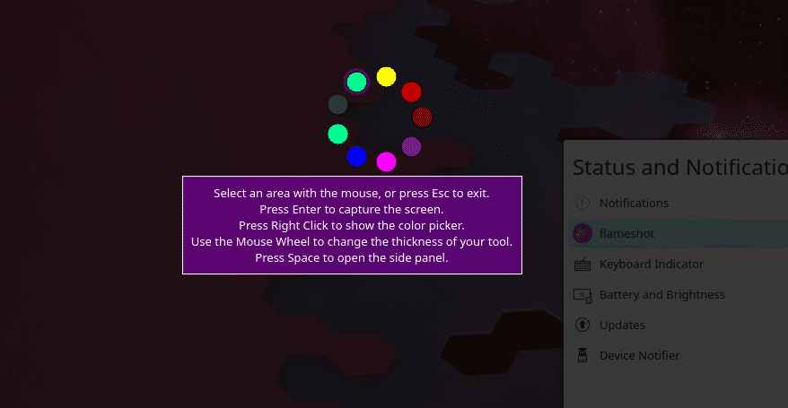

**Flameshot is a cool program for taking screenshots.**


To get it working on Arch or a similar Linux distro there are a few extra steps not written in the docs here: https://flameshot.org/docs/

The Arch Wiki page is also useful: https://wiki.archlinux.org/title/Flameshot

## 1. Download the Flameshot package:

Arch Linux:
```sh
sudo pacman -S flameshot
```
Void Linux:
```sh
sudo xbps-install flameshot
```

**To launch Flameshot from terminal:**

```sh
flameshot gui
```

## 2. Make sure you have Xbindkeys installed:

Arch Linux:
```sh
sudo pacman -S xbindkeys
```
Void Linux:
```sh
sudo xbps-install xbindkeys
```
If this is your first time setting up Xbindkeys, follow the instructions on the <a href="https://wiki.archlinux.org/title/Xbindkeys" target="_blank">ArchWiki</a> for:
- **2 Configuration**
- **3 Identifying keycodes**
- **4 Making changes permanent**

## 2. Bind your "Print Screen" key to launch Flameshot 

Open the Xbindkeys config file in your favourite editor:

```sh
~/.xbindkeysrc
```
Add Flameshot to launch when you press "Print Screen":
```
"flameshot gui"
   Print
```
**(Use the keycode specific to your machine, in my case the keycode is Print)**

## 3. Set up the Flameshot config file:

Open the configuration file in your favourite text editor:
```
~/.config/flameshot/flameshot.ini
```
Add these lines to the file:
```
[General]
drawColor=#ffff00
drawThickness=2
savePath=<path to save directory>
```
(Edit these values to change the initial draw color, line thickness, save directory, etc.)

## 4. Using Flameshot:

**Now when you press the "Print Screen" key it will launch Flameshot.**

The docs are here: https://flameshot.org/docs/guide/key-bindings/

- To change the color of the drawing tool: 

    > **Right click**

- To change the thickness of the drawing tool: 

    > **Mouse wheel**

- To open the side panel: 

    > **Space**

<br>


<br>

---

## If you found this useful:

- **BTC:** `3GoVBmKYqzQsG5B727W5MhzgZgybZKQZXz`


- **ETH:** `0x1A242F20144e8d3eB2905f8278d3b12FE3d75fb4`
- **ETC:** `0x17e17cadcE6892585faC2F573bD807567eAA2783`
- **USDT:** `0xF5d14f3BA92Df61dEF62938Eb262b0B72b82Bb81`
- **BNB:** `bnb1gfjf0vrlk4mqmzss7mww5e20kd7yvqvparpjjg`
- **DOGE:** `DKK4nENT6JzNgHgZoUbMEMvhAiNShVXJqP`
- **LTC:** `MJe3jGFgFXyZLJToYtK5gDje3huNHFoMzZ`
- **ADA:** `addr1vygxre5dngpa2fz2h34lxaezuh3m5v3l08hm9zslceagjqscplhlt`
- **DOT:** `12Tk5rhAcaf1ZRGFbrxjviAAZ9eQ6XANYh27nD7gnmWabNr`
- **SOL:** `ELPYh1RunF9pke5QkagnpiXVTWSJ2qhFmAZ93CkBLusE`
- **XRP:** `rw2ciyaNshpHe7bCHo4bRWq6pqqynnWKQg` **Tag:** `2853281782`
- **MATIC:** `0xC93742e77Be7A265bBaE4B85D21Fb365BFBA8Be0`

**Thanks, - Mike [ mathbike ]**