## 1. Set up your Google account

- Create a <a href="https://google.com/" target="_blank">Google</a> account for your business if you don't already have one:

- Add a payment method to the account so you can use the Google Cloud Platform free tier:

## 2. Set up your project:

- Sign in to Google Cloud Console: https://console.cloud.google.com

- Create a new project:

- Select the project:

- Go to Compute Engine:

or

- Enable the Compute Engine API:

## 3. Create a Debian 11 Virtual Machine:

- Create a new VM instance:

- Configure it:

## 4. Edit the machine:

- Stop the machine:

- Edit the machine:

- Change the RAM, disk size, etc.:

## 5. Create a Role:

- Navigate to the IAM page:

- Go to Roles:

- Create a Role:

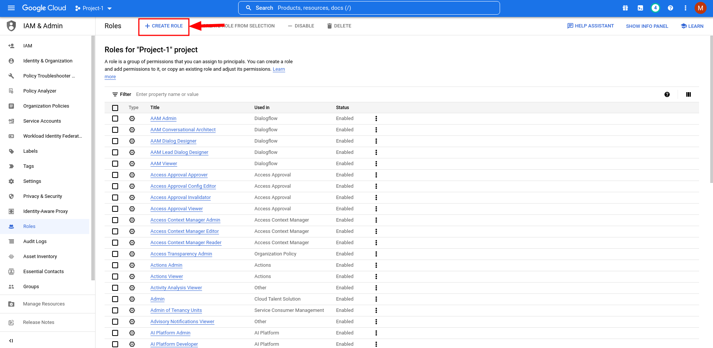

- Name it `stop/start instance`:

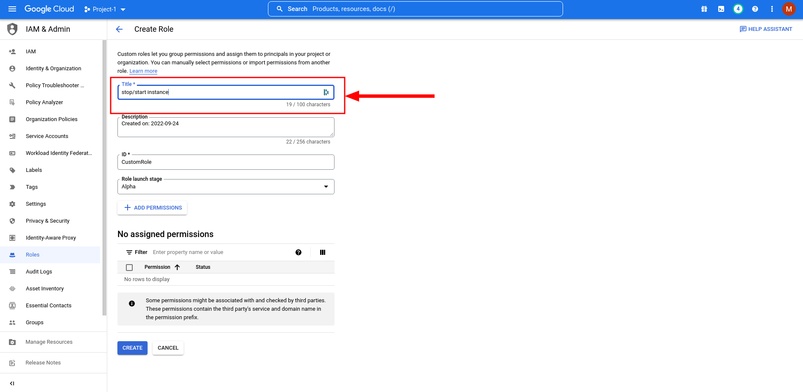

- Set the Role launch stage to `General Availability`:

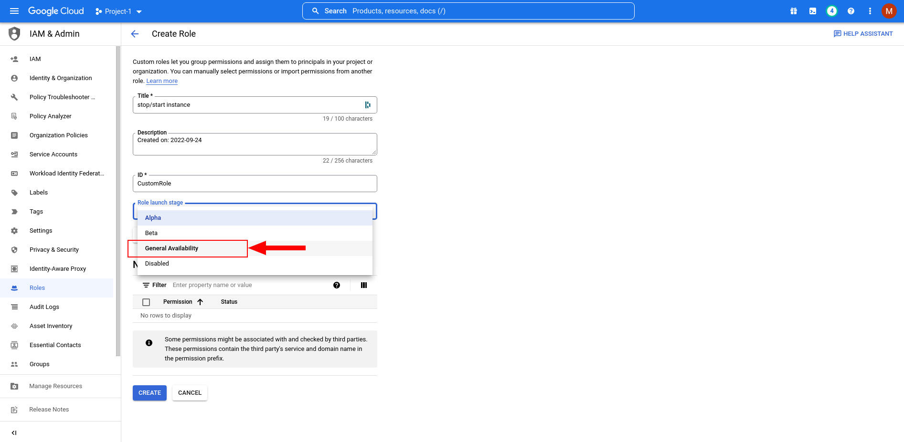

- Add the permissions:

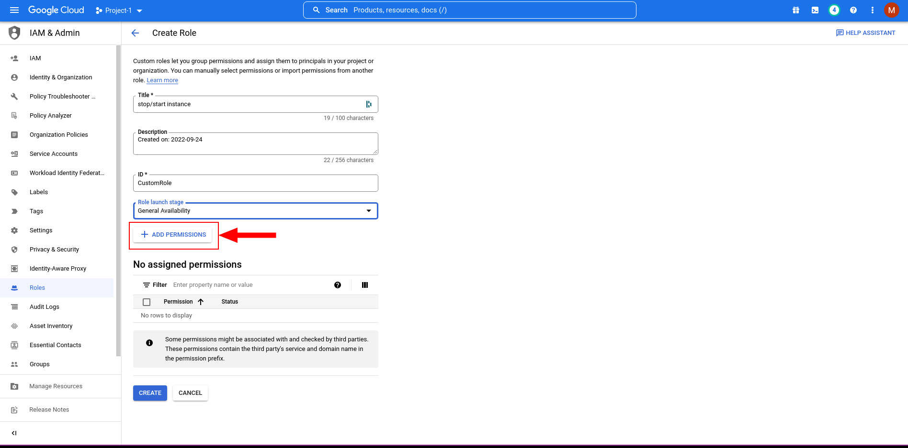

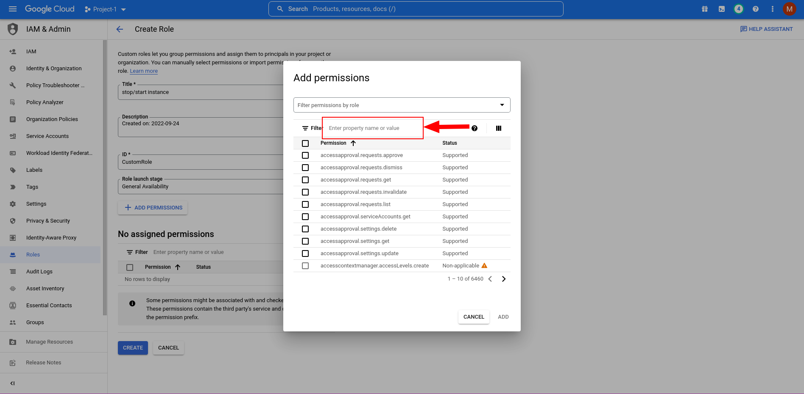

- The permissions we're adding are `compute.instances.start`:

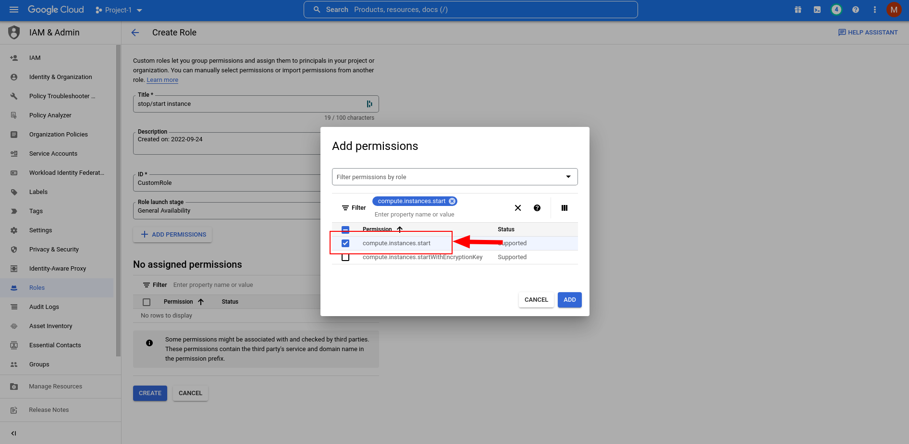

- And `compute.instances.stop`:

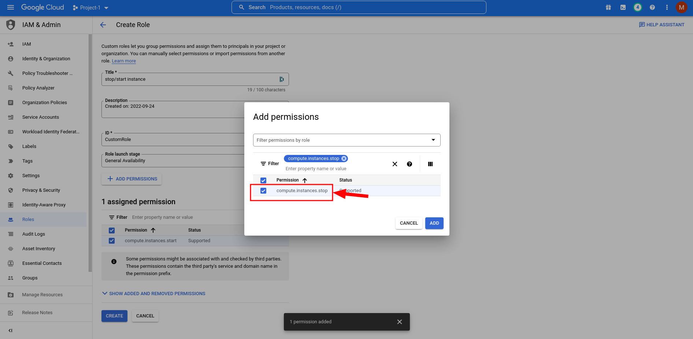

## 5. Assign the Service Agent the role we just created:

- Navigate to the IAM page:

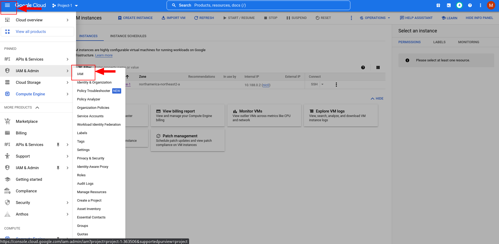

- Select "Include Google-provided role grants":

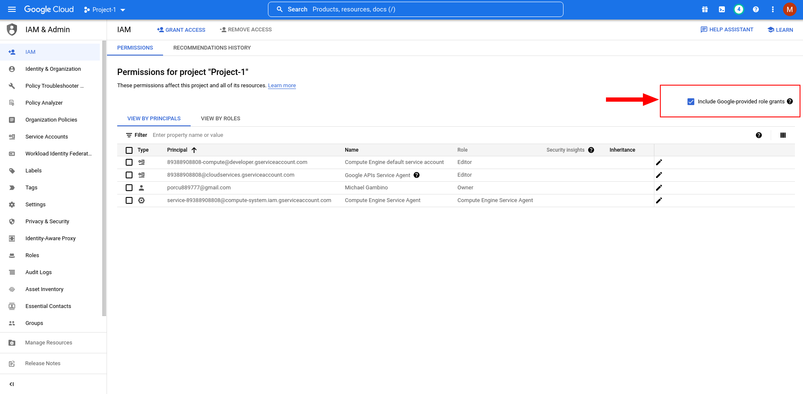

- Edit the Service Agent with `@compute-system.iam.gserviceaccount.com`:

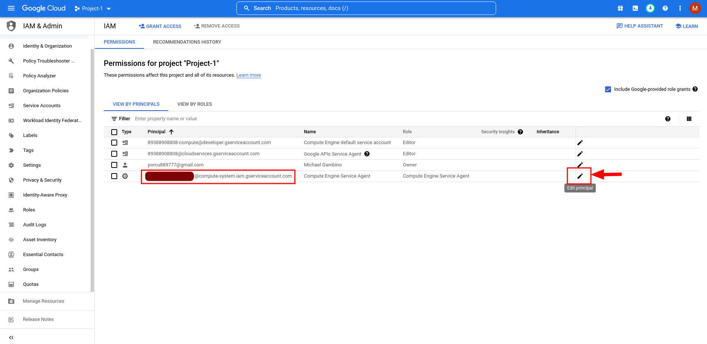

- Add another Role:

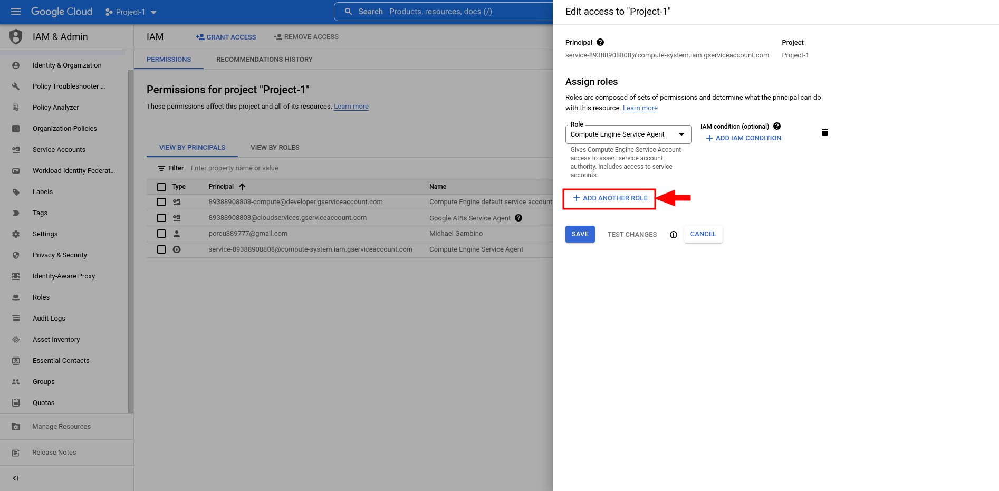

- Add the custom role `stop/start instance` we created earlier:

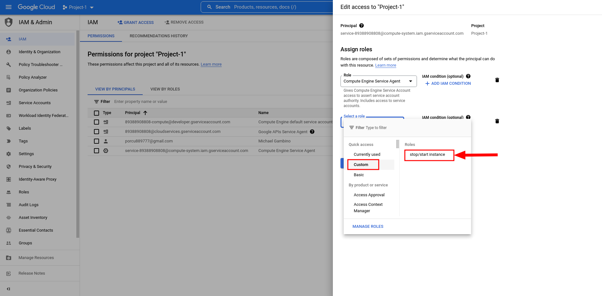

**We just gave our Service Agent the ability to stop and start our VM instance**

## 5. Create a schedule:

- Go to Compute Engine and select Instance Schedules:

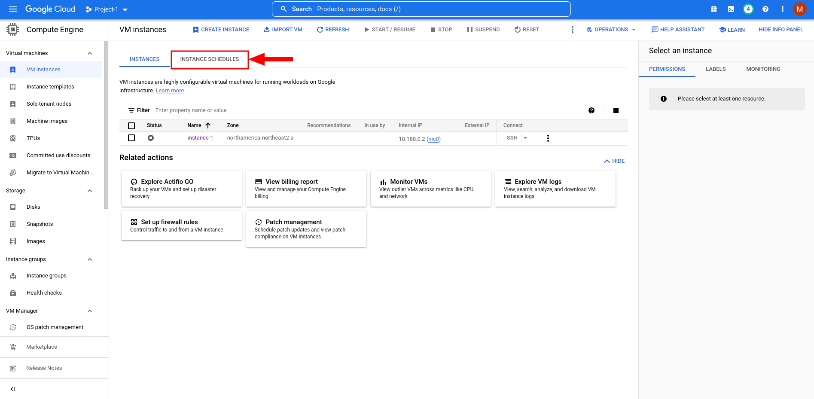

- Create an Instance Schedule:

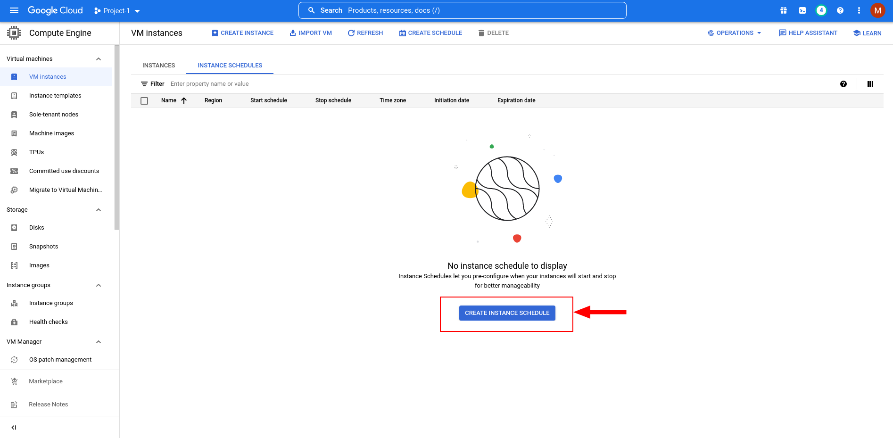

- Configure the Instance Schedule:

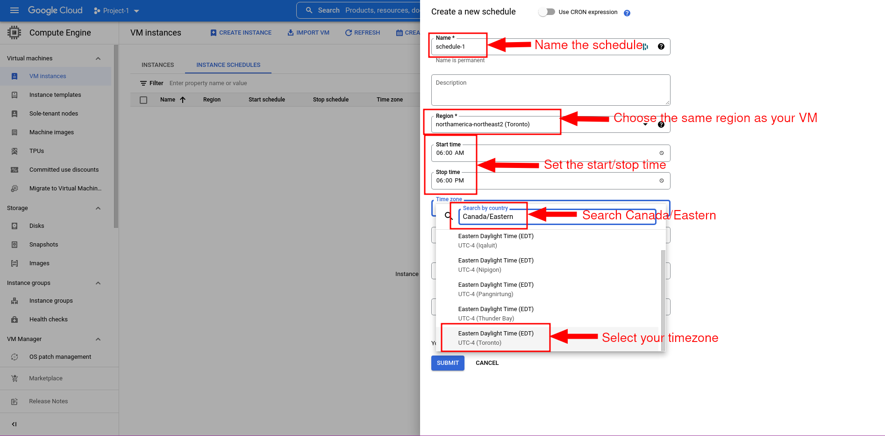

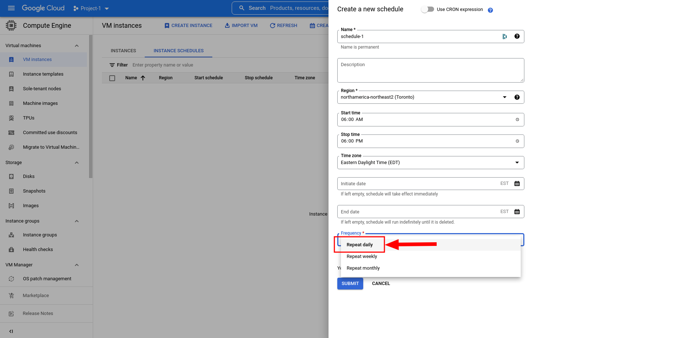

- Add our VM instance to the schedule:

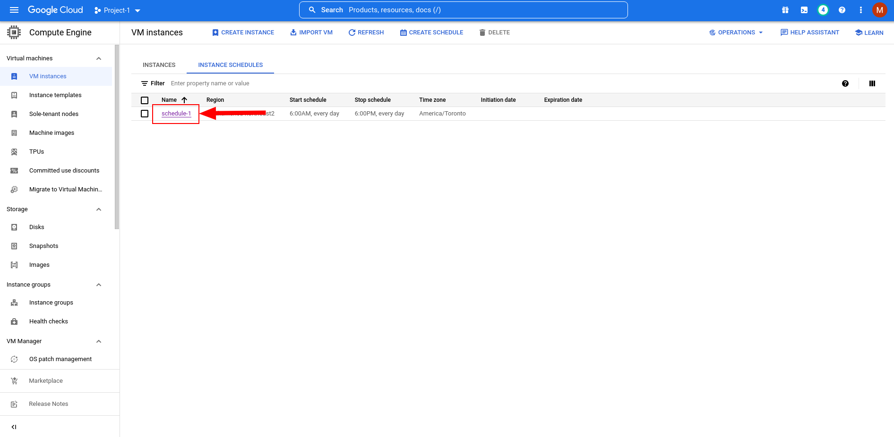

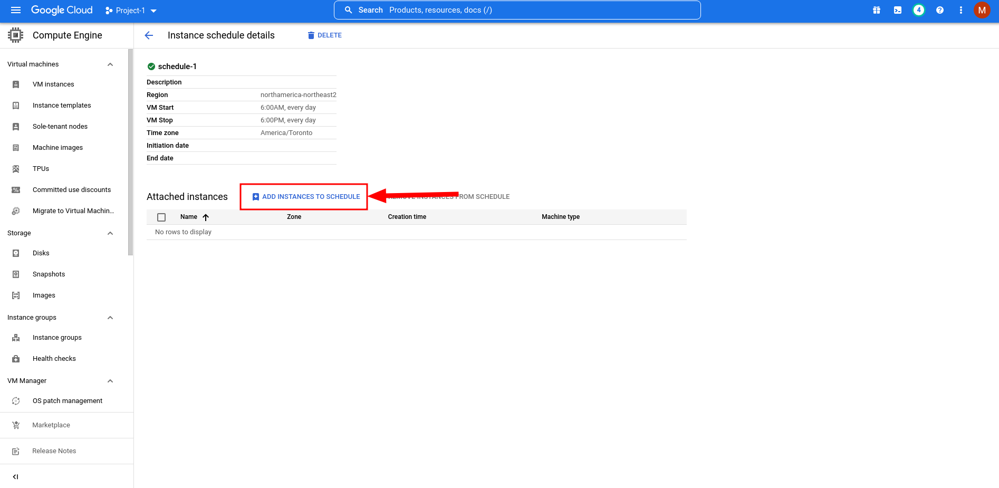

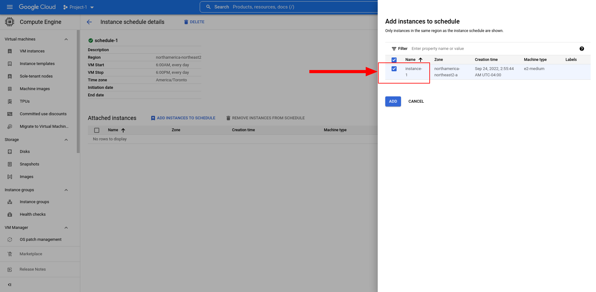

**We have now added a stop and start time to our VM instance**

## 6. SSH into the machine:

- Start the machine:

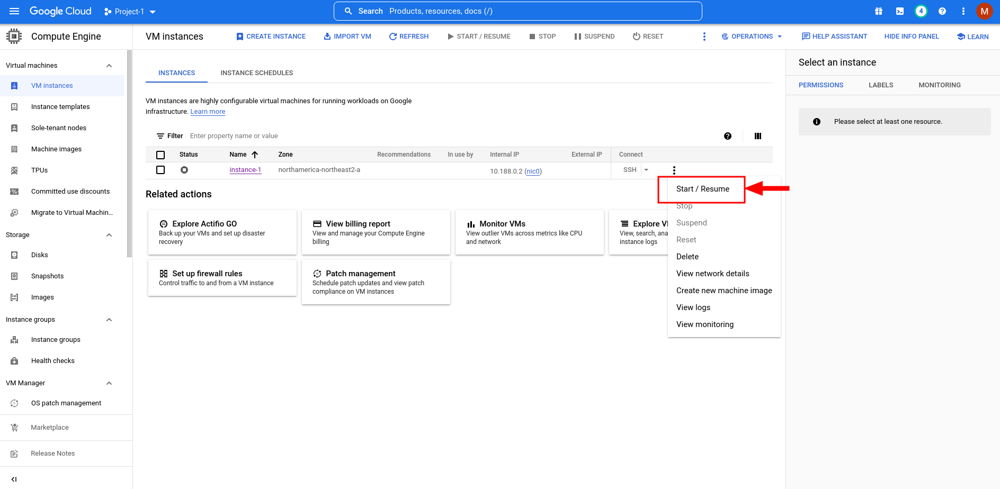

- SSH into the machine:

