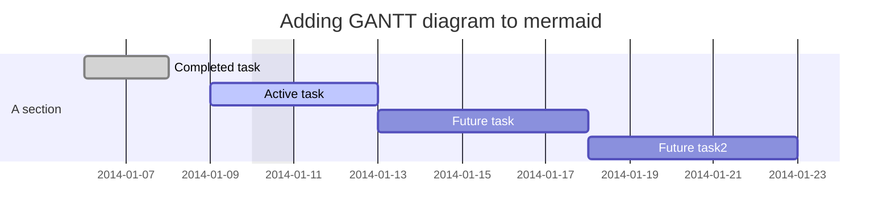

**Both processes and threads are independent sequences of execution.**

The typical difference is that threads (of the same process) run in a shared memory space, while processes run in separate memory spaces.

Threads live inside processes and share the same memory space, and can read and write to the same variables.

---



---

## Threading

```python
from threading import Thread
import os
import math

def calc():
	for i in range(0, 4000000):
		math.sqrt(i)

# each thread will contain a target,
# which is a method that is called at the beginning of that thread

threads = []

for i in range(os.cpu_count()):
	print('registering thread %d' % i)
	threads.append(Thread(target=calc))

# a thread is started by calling start()    

for thread in threads:
	thread.start()

# a thread is ended by calling join()
# which waits until the thread finishes (blocking)

for thread in threads:
	thread.join()
```
- A new thread is spawned within the existing process
- Starting a thread is faster than starting a process
- Memory is shared between all threads
- Mutexes often necessary to control access to shared data
- One GIL (Global Interpreter Lock) for all threads

---

## Multiprocessing

- A new process is started independent from the first process
- Starting a process is slower than starting a thread
- Memory is not shared between processes
- Mutexes not necessary (unless threading in the new process)
- One GIL (Global Interpreter Lock) for each process

```python
from multiprocessing import Process
import os
import math

def calc():
	for i in range(0, 4000000):
		math.sqrt(i)

processes = []

for i in range(os.cpu_count()):
	print('registering process %d' % i)
	processes.append(Process(target=calc))

for process in processes:
	process.start()

for process in processes:
	process.join()
```
