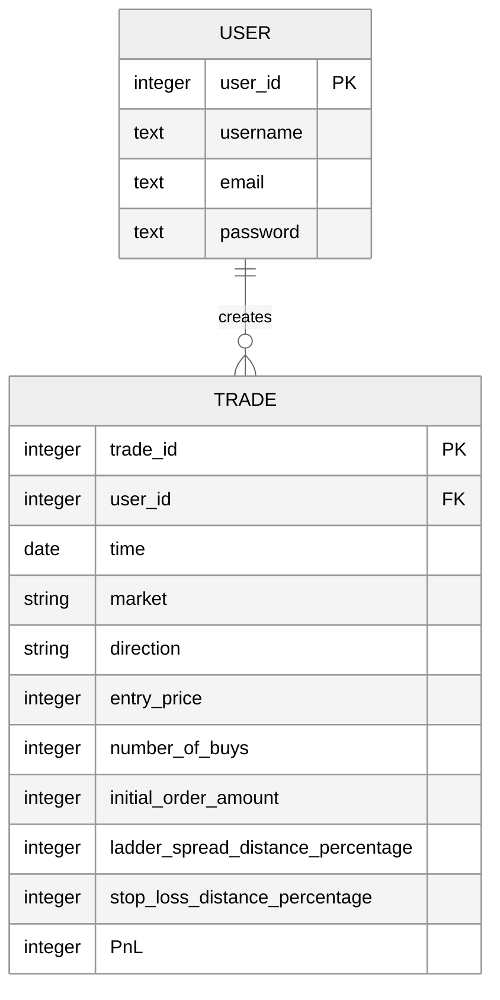

This article sources:
<a href="https://flask.palletsprojects.com/en/2.2.x/" target="_blank">https://flask.palletsprojects.com/en/2.2.x/</a>

flask_basic repo:
<a href="https://github.com/mathbike/flask_basic" target="_blank">https://github.com/mathbike/flask_basic</a>

---

A Flask application is an instance of the Flask class.

**Application Factory:**

The application factory function is the `create_app()` function in the `$NAME/__init__.py` file.  Any configuration, registration, and other setup the application needs will happen inside this function, then the application will be returned.

**Views:**

A view function is the code you write to respond to requests to your application.  The incoming request URL is matched to the view that should handle it.  The view returns data that Flask turns into an outgoing response.  Flask can also go the other direction and generate a URL to a view based on its name and arguments.

A view function can return HTML using the `render_template('index.html')` function.

**Blueprints:**

A Blueprint is a way to organize a group of related views and other code. Rather than registering views and other code directly with an application, they are registered with a blueprint. Then the blueprint is registered with the application when it is available in the factory function.

**Templates:**

Templates are files that contain static data as well as placeholders for dynamic data. A template is rendered with specific data to produce a final document. Flask uses the Jinja template library to render templates.  Templates are used to render HTML which will display in the user’s browser.


Jinja looks and behaves mostly like Python. Special delimiters are used to distinguish Jinja syntax from the static data in the template. Anything between `{{` and `}}` is an expression that will be output to the final document. Anything between `` denotes a control flow statement like `if` and `for`. Unlike Python, blocks are denoted by start and end tags rather than indentation since static text within a block could change indentation.


---

## Setup a Flask app

**This is a skeleton script for a Flask app**

Choose a name for your Flask app, run this script in the terminal, then enter the name of your Flask app in the prompt. 

```sh
echo "enter the name of your Flask app:"
read NAME
git clone https://github.com/mathbike/flask_basic ~/$NAME
cd $NAME
rm .git
python3 -m venv .venv
source .venv/bin/activate
pip install Flask Flask-WTF Flask-SQLAlchemy
deactivate
pip freeze > requirements.txt
COMMANDS_TXT="a.1_commands.txt"
echo -e "########## COMMANDS ##########\n" > $COMMANDS_TXT
echo "flask --app $NAME run" >> $COMMANDS_TXT
echo "flask --app $NAME --debug run" >> $COMMANDS_TXT
echo "flask --app $NAME init-db" >> $COMMANDS_TXT
echo "" >> $COMMANDS_TXT
echo "pip freeze > requirements.txt" >> $COMMANDS_TXT
cd
```

---

## Define the database



---

## Create the schema

`$NAME/schema.sql`
```sql

DROP TABLE IF EXISTS user;
DROP TABLE IF EXISTS trade;

CREATE TABLE user (
  id INTEGER PRIMARY KEY AUTOINCREMENT,
  username TEXT UNIQUE NOT NULL,
  password TEXT NOT NULL
);

/* CREATE TABLE user (
  id INTEGER PRIMARY KEY AUTOINCREMENT,
  username TEXT UNIQUE NOT NULL,
  email TEXT UNIQUE NOT NULL,
  password TEXT NOT NULL
); */

CREATE TABLE trade (
  id INTEGER PRIMARY KEY AUTOINCREMENT,
  user_id INTEGER NOT NULL,
  created TIMESTAMP NOT NULL DEFAULT CURRENT_TIMESTAMP,
  entry_price FLOAT NOT NULL,
  size FLOAT NOT NULL,
  FOREIGN KEY (user_id) REFERENCES user (id)
);
```

---

## Initialize the database

```terminal
flask --app $NAME init-db
```
This creates `instance/$NAME.sqlite`
