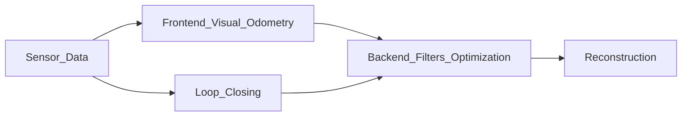

## Visual Simultaneous Localization and Mapping

**Localization:** Perception inward. Estimating the robots location.

**Mapping:** Perception outward. Building a map.

---

SLAM course:
<a href="https://www.youtube.com/playlist?list=PLgnQpQtFTOGQrZ4O5QzbIHgl3b1JHimN_" target="_blank">https://www.youtube.com/playlist?list=PLgnQpQtFTOGQrZ4O5QzbIHgl3b1JHimN_</a>

Mobile Sensing and Robotics I:
<a href="https://www.youtube.com/playlist?list=PLgnQpQtFTOGQEn33QDVGJpiZLi-SlL7vA" target="_blank">https://www.youtube.com/playlist?list=PLgnQpQtFTOGQEn33QDVGJpiZLi-SlL7vA</a>

Mobile Sensing and Robotics II:
<a href="https://www.youtube.com/playlist?list=PLgnQpQtFTOGQh_J16IMwDlji18SWQ2PZ6" target="_blank">https://www.youtube.com/playlist?list=PLgnQpQtFTOGQh_J16IMwDlji18SWQ2PZ6</a>

Slambook:
<a href="https://github.com/gaoxiang12/slambook-en" target="_blank">https://github.com/gaoxiang12/slambook-en</a>

---

**Two Sensor Classes:**
- *Non-intrusive sensors*; entirely self contained inside the robot, like cameras or laser scanners, does not assume a cooperative environment.
- *Intrusive sensors*; prepared environment, like GPS or rails, can usually locate the robot directly, solving localization.

**Monocular Camera:** One single camera. No depth. Can not obtain the distance between objects. Must change the view angle (move) to estimate depth.   

**Stereo Camera:** Two synchronized monocular cameras, distance between is known, can be used to calculate depth.

**RGB-D Camera:** Depth camera. Sends light out and measures time it takes to return.

---

**Visual SLAM Framework:**

**Sensor Data:** Acquisition and preprocessing of camera images and/or other sensors.

**Visual Odometry:** Aka frontend. Estimate the camera's movement between adjacent image frames and generate a rough local map. The map will contain drift, which needs to be addressed with backend optimization and loop closing.

**Backend Optimization:** The process of dealing with noise. Receives camera poses at different time stamps from visual odometry, and results from loop closing, then applies
optimization to generate a fully optimized trajectory and map. Because it is connected after visual odometry it is known as the backend.

**Loop Closing:** Identify scenes it has seen before. Determines whether the robot has returned to its previous position in order to reduce the accumulated drift. If a loop is detected, it will provide information to the backend for further optimization.

**Reconstruction:** Constructs a task-specific map based on the estimated camera trajectory.

**Mapping:** The process of building a map. Different kinds of maps: 2D grid map, 2D topological map, 3D point clouds and 3D meshes.

**Metric Maps:** Metrical maps emphasize the exact metrical locations of the objects in maps. They are usually classified as either sparse or dense. Sparse metric maps store the scene into a compact form and do not express all the objects. Dense metrical maps focus on modeling all the things that are seen. A sparse map is usually enough for localization, while for navigation a dense map is usually needed.

**Topological Maps:** Emphasize the relationships among map elements. A topological map is a graph composed of nodes and edges, only considering the connectivity between nodes. It relaxes the requirements on precise
locations of a map by removing map details and is, therefore, a more compact expression. However, topological maps are not good at representing maps with complex structures.

---

## Mathematical Formulation of SLAM Problems

Let $t$ be a discrete time step from $1,...,k$.

Let $ \mathbf{x} $ be the position of the robot, expressed as $\mathbf{x}_1,...,\mathbf{x}_k$ at discrete time steps.

Let $ \mathbf{y} $ be the landmarks, if there are $N$ landmarks, we can express them as $\mathbf{y}_1,...,\mathbf{y}_N$.

Let $ \mathbf{u} $ be the inputs to the robot, expressed as $\mathbf{u}_1,...,\mathbf{u}_k$ at discrete time steps.

Let $ \mathbf{z} $ be the observations, expressed as $\mathbf{z}_1,...,\mathbf{z}_k$ at discrete time steps.

Let $ \mathbf{w} $ be the noise.

---

The motion equation: $ \mathbf{x}_k = f( \mathbf{x}\_{k-1}, \mathbf{u}_k, \mathbf{w}_k ) $

The current position equals a function of the previous position, the input commands, and the noise.

The observation equation: $ \mathbf{z}_{k,j} = h( \mathbf{y}_j, \mathbf{x}_k, \mathbf{v}\_{k,j} ) $
