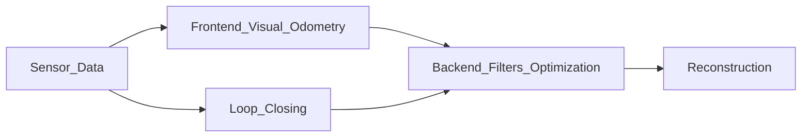

## Visual Simultaneous Localization and Mapping

SLAM course:
<a href="https://www.youtube.com/playlist?list=PLgnQpQtFTOGQrZ4O5QzbIHgl3b1JHimN_" target="_blank">https://www.youtube.com/playlist?list=PLgnQpQtFTOGQrZ4O5QzbIHgl3b1JHimN_</a>

Mobile Sensing and Robotics I:
<a href="https://www.youtube.com/playlist?list=PLgnQpQtFTOGQEn33QDVGJpiZLi-SlL7vA" target="_blank">https://www.youtube.com/playlist?list=PLgnQpQtFTOGQEn33QDVGJpiZLi-SlL7vA</a>

Mobile Sensing and Robotics II:
<a href="https://www.youtube.com/playlist?list=PLgnQpQtFTOGQh_J16IMwDlji18SWQ2PZ6" target="_blank">https://www.youtube.com/playlist?list=PLgnQpQtFTOGQh_J16IMwDlji18SWQ2PZ6</a>

Slambook:
<a href="https://github.com/gaoxiang12/slambook-en" target="_blank">https://github.com/gaoxiang12/slambook-en</a>

---

**Localization:** Where am I? Perception inward.

**Map Building:** What is the environment like? Perception Outward

**Two Sensor Classes:** Non-intrusive sensors; entirely self contained inside the robot, does not assume a cooperative environment. Intrusive sensors; prepared environment, like GPS or rails, can usually locate the robot directly, solving localization.

**Monocular Camera:** One single camera. No depth. Can not obtain the distance between objects. Must change the view angle (move) to estimate depth.   

**Stereo Camera:** Two synchronized monocular cameras, distance between is known, can be used to calculate depth.

**RGB-D Camera:** Depth camera. Sends light out and measures time it takes to return.

**Visual SLAM Framework:**

**Visual Odometry:**

**Backend Optimization:**

**Loop Closing:**

**Mapping:**

**Metric Maps:**

**Topological Maps:**

---

Let $T$ be the set of all time.  Let $t$ be a discrete time step from $1,...,k$. Therefore $ \lbrace t \in T \big\vert t_1,...,t_k \rbrace $.

Let $T$ be the set of all time.  Let $t$ be a discrete time step from $1,...,k$. Therefore $ \lbrace t \big\vert t \in T ,t_1,...,t_k \rbrace $.

$\textbf{x}$ = position, expressed as $\textbf{x}_1,...,\textbf{x}_k$ at discrete time steps

$\textbf{u}$ = inputs, expressed as $\textbf{u}_1,...,\textbf{u}_k$ at discrete time steps

$\textbf{z}$ = inputs, expressed as $\textbf{z}_1,...,\textbf{z}_k$ at discrete time steps

---

Let $ \mathbf{x} $ be the position of the robot

Let $ \mathbf{u} $ be the inputs to the robot

Let $ \mathbf{z} $ be the observations

Let $ \mathbf{w} $ be the noise

---

The motion equation: $ \mathbf{x}_k = f( \mathbf{x}\_{k-1}, \mathbf{u}_k, \mathbf{w}_k ) $

The current position equals a function of the previous position, the input commands, and the noise.

The observation equation: $ \mathbf{z}_{k,j} = h( \mathbf{y}_j, \mathbf{x}_k, \mathbf{v}\_{k,j} ) $
